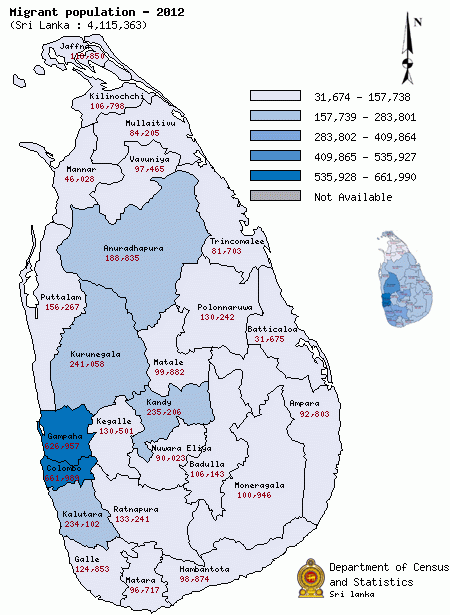

# Analysis of outer suburbs in Colombo concerning land prices and density of social places

 

## Introduction

Colombo is the commercial capital and largest city of Sri Lanka by population. Colombo metropolitan area has a population of 5.6 million and 752,993 in the city [1]. It is the financial centre of the island and major hub for transport, healthcare and education. It is located on the west coast of the island and adjacent to the Greater Colombo area which includes Sri Jayawardenepura Kotte which is the legislative capital of Sri Lanka. Colombo is also the administrative capital of the Western Province and the district capital of Colombo District.

When compared with the rest of Sri Lanka, Colombo metropolitan region is home to 28 per cent of Sri Lanka’s population and accounts for about 45 per cent of national GDP. Moreover, it dominates 80 per cent of industrial value in Sri Lanka [2]. It is the country’s major urban agglomeration and is growing faster than any other areas in Sri Lanka. Because of that hundreds of thousands of people migrate to Colombo and nearby areas each year for several reasons. According to the department of senses and statistics, more than 31 per cent migrant population migrate to Colombo and Gampaha which is an adjacent district of Colombo [Figure:1] [3]. It is more than five times higher than the people who migrate to Kandy which is the second major city in Sri Lanka. 

 
 

 
Figure 1 : Migrant Population of Sri Lanka

 

## Problem

However (CMR) covers only about 6 per cent of the country’s total land area [2]. Because of the shortage, property prices are skyrocketing each year. Therefore, it is extremely difficult to find a better suburb to buy a property to a migrant. They want to find areas where real estate values are lower. at the same time, they want to find areas which have a higher density of social places according to their interest. The objective of this study is to address the above issue by clustering outer Colombo suburbs concerning land prices and density of social places.

 

## Data

    <ul>
        <li>
            List of outer suburbs in Colombo can be found on Wikipedia article: Colombo [4]. For this study, inner Colombo city suburbs and capital zone suburbs are not used since they are more suitable for business purposes rather than residential purpose.
        </li>
        <li>
            Geo-Coordinates of each suburb can be retrieved from ArcGIS geocode library for Python [5].
        </li>
        <li>
            Most common places for a given suburb can be obtained from  Foursquare API [6].
        </li>
        <li>
            Average land price per perch for above suburbs are available on lankapropertyweb [7].
        </li>
        <li>
            BeautifulSoup web scraping Python library can be used to scrape data from above web pages [8].
        </li>
    </ul>

## References

   1. <a href='https://en.wikipedia.org/wiki/Colombo'>Colombo</a>
   2. <a href='https://www.worldbank.org/en/country/srilanka/overview#3'>Overview of Sri Lanka by World Bank</a>
   3. <a href='http://www.statistics.gov.lk/'>Department of census and Statistics</a>
   4. <a href='https://en.wikipedia.org/wiki/Colombo#Outer_suburbs'>Outer Suburbs of Colombo</a>
   5. <a href='https://developers.arcgis.com/'>ArcGIS GeoCoding</a>
   6. <a href='https://developer.foursquare.com/'>Foursquare API for Developers</a>
   7. <a href='https://www.lankapropertyweb.com/house_prices.php'>Average Land perch prices in Western Province</a>
   8. <a href='https://www.crummy.com/software/BeautifulSoup/bs4/doc/'>Beautiful Soup Documentation</a>